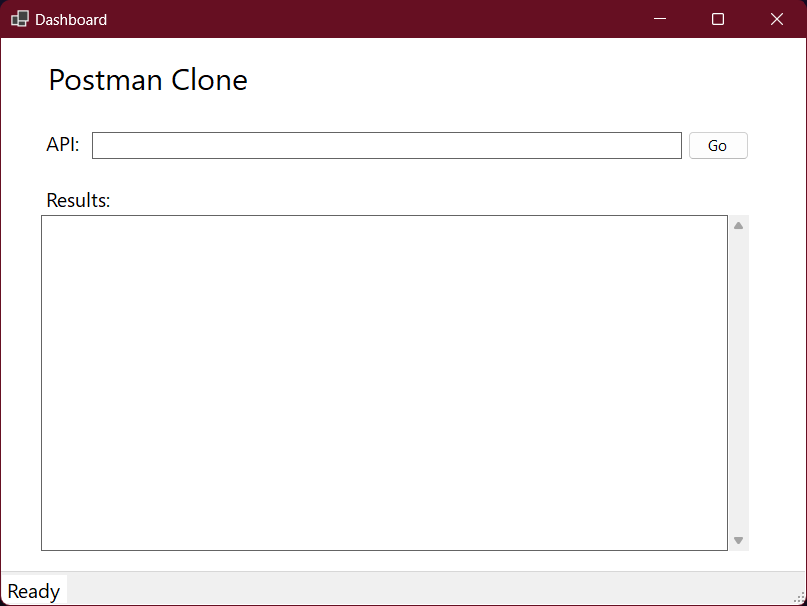
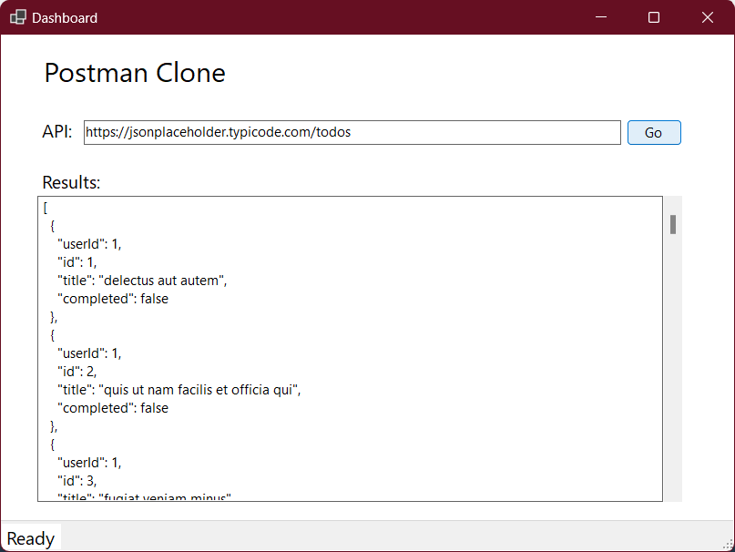

# Postman Clone
Postman Clone provides a user-friendly interface for making GET requests to APIs and viewing responses in formatted JSON. Ideal for developers and testers, this tool simplifies API interaction and debugging, helping you efficiently validate and troubleshoot in your API calls.

## Technologies Used
* C#
* .NET 8
* WinForms
* HttpClient

## Using The App
1. Download the executable file from the release section.
2. When the application launches, it should look like this.

3. Fill in your API URL and hit Go.

## Upcomming changes
* Adding POST, PUT, PATCH, and DELETE functionality
* Adding API headers
* Handling API authentication
* Adding Dependecy Injection
* Adding Logging
* Create a web-based user interface for the application
